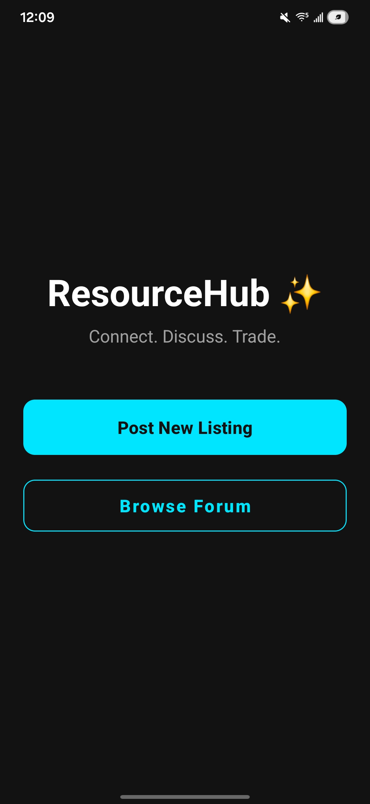
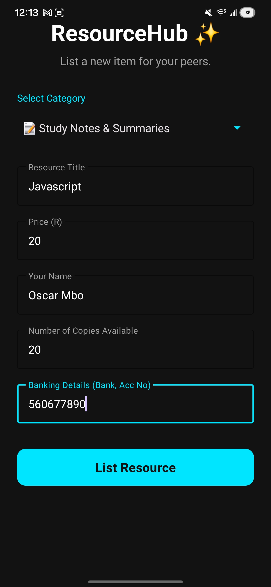
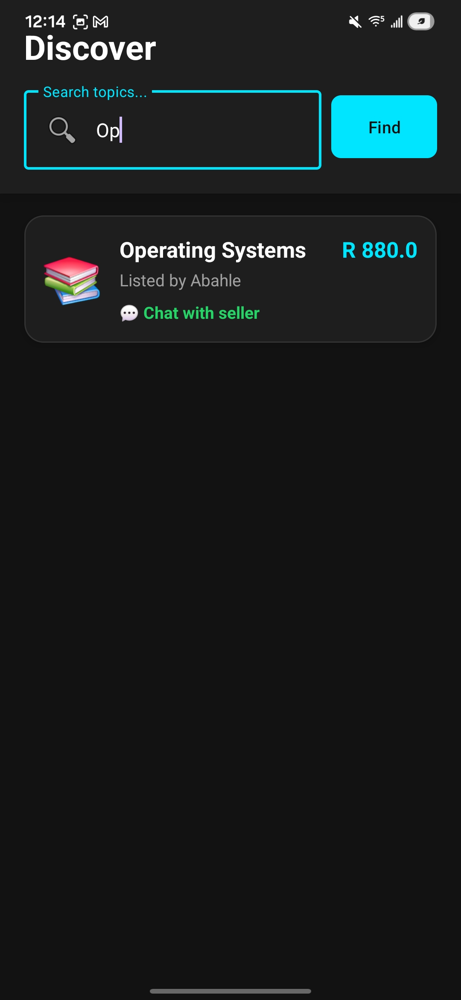
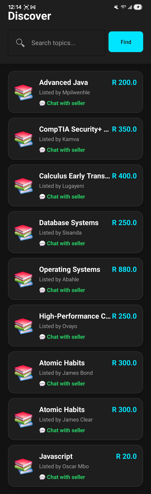

# 📚 ResourceHub: Peer-to-Peer Textbook Exchange

## 📖 Project Overview

ResourceHub is a fully functional, native Android application engineered to serve as a decentralized peer-to-peer marketplace for students to securely buy, sell, and discover textbooks.

Built from the ground up using Java 17+ and the Android SDK, the core architecture prioritizes strict Object-Oriented Design (OOD) principles, comprehensive exception handling, and seamless SQLite data persistence, all wrapped in a highly responsive Material Design 3 user interface..

---

## ✨ Key Features

* **Dynamic Marketplace Browsing:** A seamless `RecyclerView` implementation allowing users to scroll through all available peer-listed textbooks.
* **Comprehensive Resource Listing:** Users can list new materials by providing granular details, including dynamic stock counts, pricing, category classification, and banking information.
* **Smart Search & Filtering:** A highly responsive search engine leveraging SQLite `LIKE` queries to instantly filter the database by either the **Book Title** or the **Seller's Name**.
* **Intelligent Validation & Duplicate Prevention:** Real-time form validation and a custom SQLite duplicate-checker that intercepts and prevents identical listings from the same seller.
* **Direct WhatsApp Integration:** A frictionless communication bridge utilizing Android `Intents` to instantly generate a pre-formatted WhatsApp message to the seller directly from the application.
* **Material Design Architecture:** A dark-themed, high-contrast user interface built with Google's Material Components (`TextInputEditText`, `MaterialButton`, `MaterialAlertDialogBuilder`) for a modern UX.

---

## 🏗️ Object-Oriented Architecture

To satisfy the core academic requirements of CSC313, the system’s architecture heavily utilizes advanced Java OOP paradigms:

* **Encapsulation & Modularity:** Clean separation of concerns between the View (XML), Controllers (Activities), and Data Models (`Textbook.java`).
* **Exception Handling:** Robust `try-catch` blocks surrounding numerical parsing (Price, Copies) and database transactions to prevent application crashes and ensure data integrity.
* **Abstraction & Interfaces:** Engineered for scalable inventory management using core OOP structural design patterns.

---

## 🤝 The Development Team

This system was engineered collaboratively using a highly structured Git feature-branch workflow. 

* **Mpilwenhle Jubane** - Project Lead, Application Architecture, and UI Overhaul.
* **Lugayeni Anele** - Database Architecture (SQLite Schema & CRUD operations).
* **Kamva Fetumani** - Search Engine Logic and WhatsApp `Intent` Integration.
* **Ovayo Kani** - Data Validation, Exception Handling, and Duplicate Checking Logic.
* **Abahle Mati** - UI Layout Design and Add Resource implementations.
* **Sisanda Gcuma** - Systems Analysis and Material Dialog View integrations.

---

## 🚀 Quick Start Guide

This application utilizes a local, on-device SQLite database. No external server configuration or database installation is required.

**1. Clone the repository:**
`git clone https://github.com/Mjubane5/AndroidAssignment2.git`

**2. Open in Android Studio:**
* Launch Android Studio.
* Select **File > Open** and navigate to the cloned directory.
* Wait for the Gradle sync to complete.

**3. Build and Run:**
* Ensure an Android Emulator (API 24+) is running, or connect a physical Android device via USB debugging.
* Click the **Run 'app'** (Green Play Button) in the top toolbar.
* *Note: Upon first launch, the SQLite database is automatically seeded with initial group data for immediate demonstration.*
git clone [https://github.com/Mjubane5/AndroidAssignment2.git](https://github.com/Mjubane5/AndroidAssignment2.git)

## 📸 Application Showcase

| Home Dashboard | Resource Listing | Smart Search & Chat | Detail View |
|:---:|:---:|:---:|:---:|
|  |  |  |  |

## 🔮 Future Enhancements
While the current system fully satisfies the core peer-to-peer textbook exchange requirements, future iterations could include:
* **In-App Messaging:** Migrating from WhatsApp Intents to a native Firebase real-time chat system.
* **Image Uploads:** Allowing sellers to upload photos of the textbook's physical condition.
* **Secure Payment Gateway:** Integrating a sandbox payment API (like PayFast or Yoco) to handle transactions directly within the app rather than relying on manual EFTs.

## ⚙️ Technical Environment
* **Minimum SDK:** API 24 (Android 7.0 Nougat)
* **Target SDK:** API 34 (Android 14)
* **Build System:** Gradle
* **Database:** SQLite (On-device, local storage)

